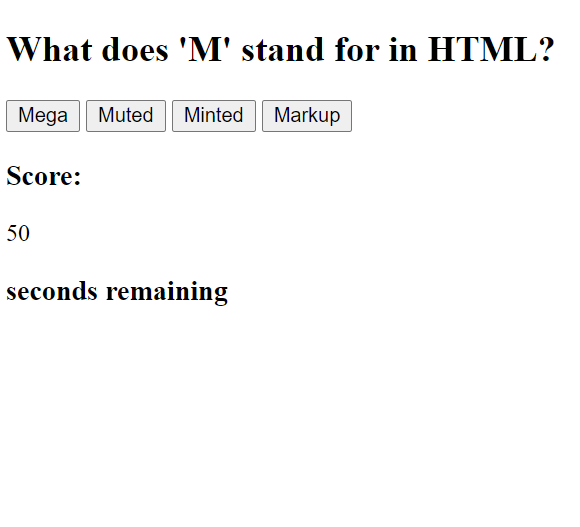

# Code Quiz
---
Project Assignment was to create a multiple choice quiz that is timed and cycles through several questions before requiring user to enter name and score to local storage using JSON. 

## Main Objectives and Obstacles
---

- I created three staging Divs in the html that would be the main pages used in javascript - a Start Page, Questions Page and Scores Page. I did this by calling functions to set and remove display attributes to those pages. 
- I also created an array in .js made up of objects that each contained a Question, Answer and another array of Choices. Had to make those objects correspond to buttons in the Questions Page and cycle through each object till reaching the end. 
- Once the questions array finishes, it calls a function to the scores page where user enters name that is stored to the local storage. The name and score should display on the page after entry. 

---

- I had some struggles with several of the areas of this assignment. The first main struggle was understanding how to structure the functions in javascript to cycle through the array of questions and input those values into the buttons in the html, then to finally have it exit the cycle without errors. 
- Another main issue I had was figuring out how to make the quiz push the user name and score successfully to local storage.

---

Links: 
[For Access to Live Site](https://mjpagenkopf.github.io/code_quiz/)

--
[For Access to Repository](https://github.com/mjpagenkopf/code_quiz)

---
Screenshot:

---